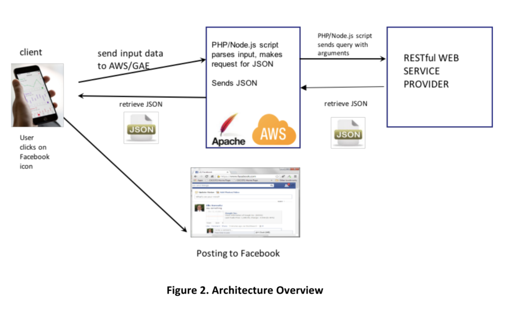
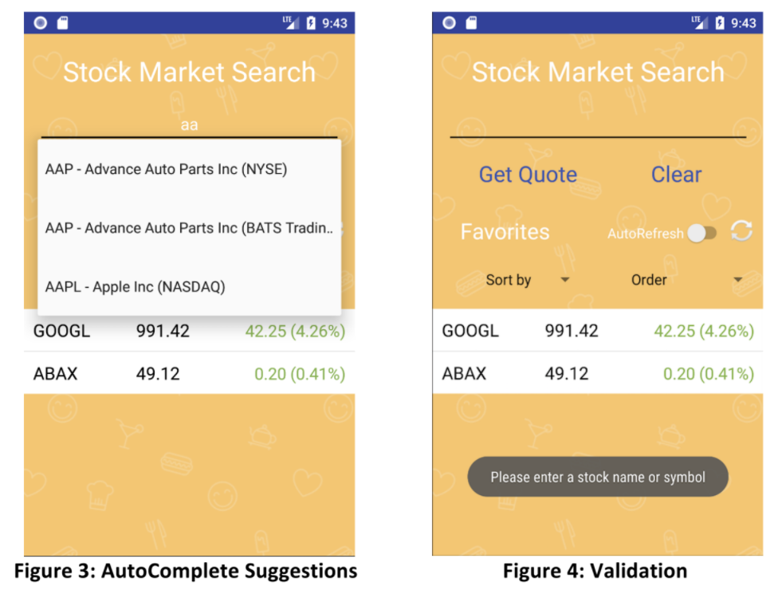
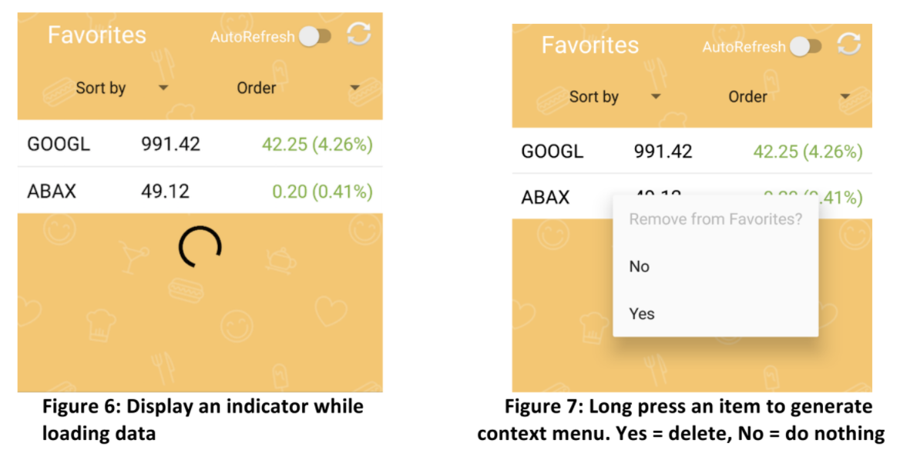
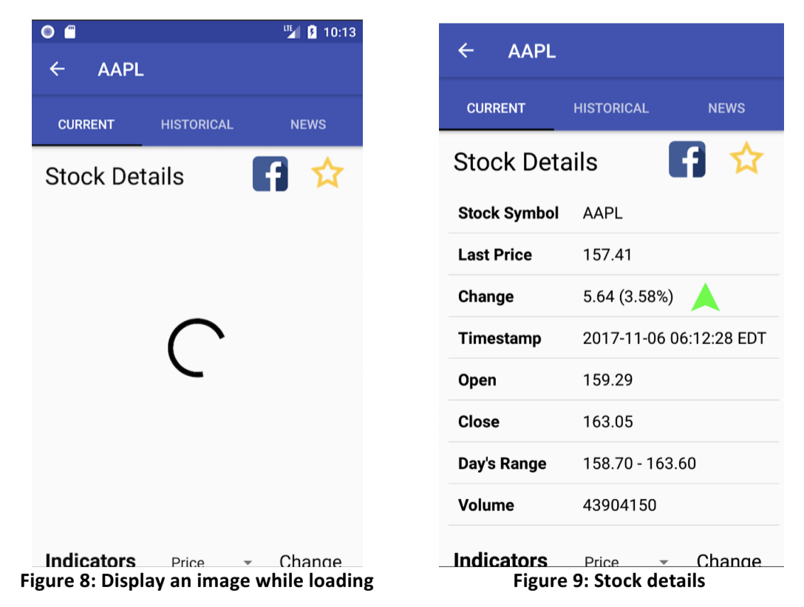
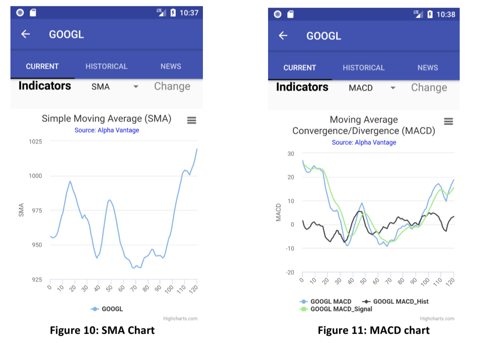
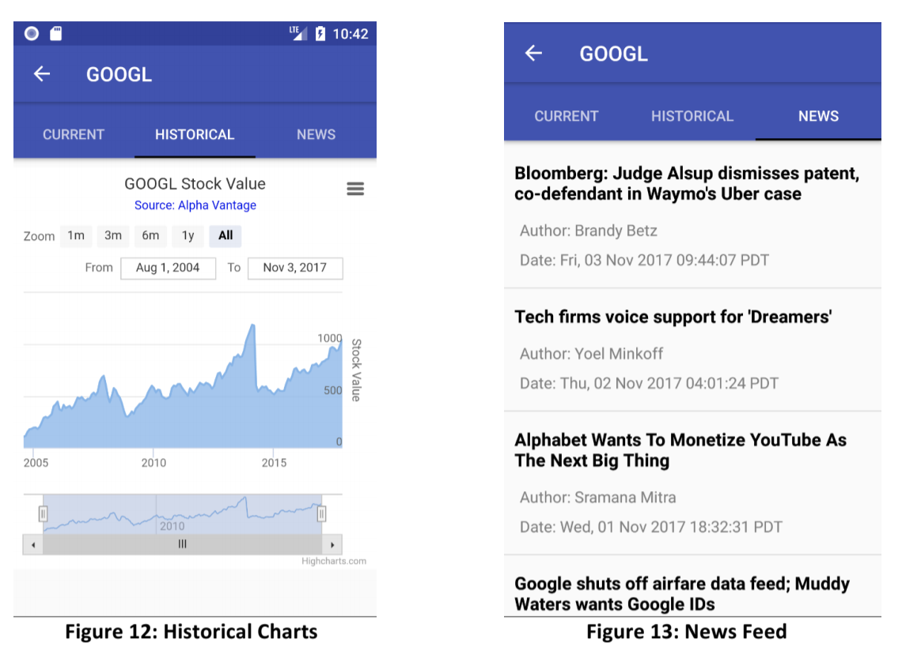
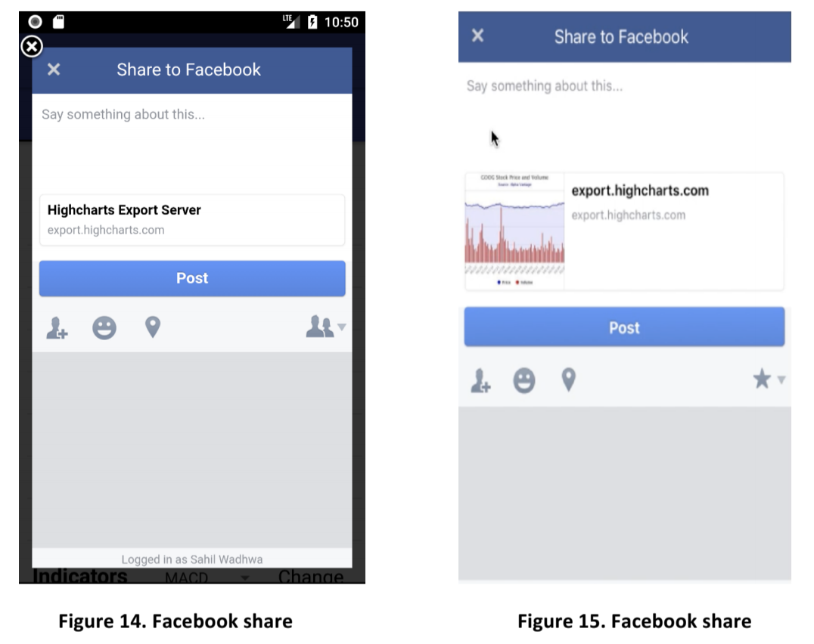

# StockSearchApp

## Project Description
A mobile app version of StockSearchWeb. An Android mobile application, which allows users to search for stock information, save some stock symbols
as favorites, and post to the Facebook timeline.
The main “scene” of this app is like the one shown in Figure 1, where the user can enter the
stock ticker symbol and select from a list of matching stock symbols using “autocomplete.” A
“stock quote” on a matched stock symbol can be retrieved.
Once the user has entered some characters in the edit box and selected a matching result from
the autocomplete list, he/she would click on Get Quote, at which point validation must be done
to check that the entered data is not empty.

Once the validation is successful, we would get the stock details using our Node.js script hosted on
Amazon Web Services, which would return the result in JSON format. We
would display the stock details in a ListView component in the ‘Current’ tab. Furthermore, our
Node.js script would be responsible for rendering the HighCharts in the ‘Current’ and ‘Historical’
tabs and also rending the news articles in the ‘News’ tab.

### Autocomplete
The user can enter the stock name or symbol in the text view to get the stock information from
our Node.js script. Based on the user input, the AutoComplete would display the all the matching
companies and symbols (see Figure 2) by making a HTTP request. The auto-complete dropdown
is shown only when the user has typed in at least one character and the maximum number of
results displayed in the auto-complete dropdown is 5.
If the user selects one of the results from the auto-complete dropdown, the content of the
result (symbol with the company name) should be copied to the input field and the
autocomplete dropdown then disappears.
If the user taps on an area other than the auto-complete form, the dropdown should be hidden.

### Favorite List
The Favorites list interface consists of the following:

• An Automatic Refresh switch, labeled AutoRefresh

• A Refresh button

• Two “Spinners” controlling the order of the list

• The Favorite “Custom ListView” showing a list of favorite stocks

The stocks in the user’s Favorites list would be displayed in a list as per Figure 6, 7.

### Stock Details
The stock detail section should have 3 views:

• Current Stock

• Historical Charts

• News Feeds

The Stock Details would be starting with the ‘Current’ view as loaded by default.
Furthermore, the stock details would have a list showing all the stock values. The following
stock values should be displayed: Stock Symbol, Last Price, Change, Timestamp, Open,
Close, Day’s Range, Volume.

The News feed page represents news articles related to the current stock. The app should open the article in the browser window (Mobile
browser, default is Chrome) if one row is selected.

### Facebook share

The “Facebook” icon should be provided to post the current stock chart shown in the app on
Facebook. 

